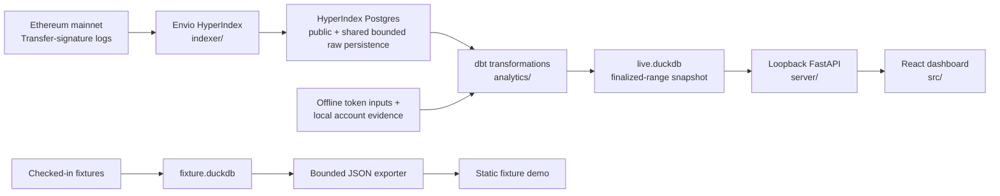

# EVM Wallet Search

An evidence-first Ethereum wallet interaction dashboard for selected Ethereum wallets. The project
indexes wallet-relevant `Transfer(address,address,uint256)` logs with Envio HyperIndex, builds
reproducible DuckDB analytics with dbt, and serves them through a loopback FastAPI API to a React
dashboard.

The current target is Ethereum mainnet (`chain_id = 1`). The pinned fixture address and its
`vitalik.eth` label are demo configuration only, not a live fallback or live ENS-resolution claim.
Live scan jobs accept an address or resolve ENS through the server-side boundary at a finalized block.

> [!IMPORTANT]
> The event source is ERC-20-intended, not standards-proof. ERC-721 uses the same `Transfer`
> signature, and the wildcard indexer does not yet disambiguate token standards. A captured log
> proves that a contract emitted the signature; it does not prove intent, economic ownership,
> transaction initiation, standards compliance, token legitimacy, or historical account type.

## MVP boundary

The MVP includes emitted Transfer participants and exact raw values, wallet-relative direction,
selected top-level transaction sender/target evidence, exact-address token recognition, and
pinned-block bytecode observations for counterparties.

It does not include native ETH transfers, traces, internal calls, approvals, NFT-specific
interpretation, arbitrary wallet lookup, or USD prices.
Recognition means registry membership or a manual local override—not safety. `EOA` presentation
means no bytecode was observed at one pinned block—not proof of personhood, control, permanence,
or account history.

## Architecture



The two delivery paths are deliberately separate. Local development queries complete matching
rows within the recorded `live.duckdb` coverage through the API. The static build reads only
bounded fixture JSON and cannot establish live HyperIndex coverage. See
[ARCHITECTURE.md](ARCHITECTURE.md) for dependency rules, trust boundaries, and known gaps.

Each live build transforms one selected wallet interval, but `live.duckdb` retains completed
projections and finalized run history for every scanned wallet. `EVM_WALLET_SCAN_ADDRESS` selects
one wallet for a manual live build; the dashboard supplies its selected wallet to the bundled
bounded worker. Shared token and counterparty enrichment remain keyed by canonical address rather
than repeated per wallet.

## Dashboard and demo

The local dashboard exposes:

- exact selection totals alongside bounded rankings and cursor-paginated events;
- yearly/monthly captured-event timelines with explicit inbound, outbound, and self directions;
- token and counterparty rankings by captured event count, never cross-token quantity or value;
- responsive token and counterparty rankings with themed vertical scrolling and no horizontal pan;
- provenance that separates finalized scan coverage from observed event extrema;
- `All`, `Recognized`, and `Other` token views plus pinned-block `EOA`/`Contract` evidence.
- live mode selection among completed wallets without rescanning, plus separate wallet/ENS scan
  submission with honest stage-based activity feedback, last-good dashboard preservation and retry on
  refresh failure, and automatic switching; fixture mode keeps scanning disabled.

Scan jobs are exposed by the local API and use the bundled bounded worker by default.
`WALLET_SCAN_COMMAND` remains an optional adapter override. The worker indexes only the wallet's
missing finalized range, merges validated raw rows into shared Postgres persistence, updates a
staged copy of the complete DuckDB artifact, and lets the API publish it atomically only after
preservation and provenance validation succeed.

The production Vite build is the deterministic fixture demo. It is useful for interaction and
presentation checks, but its fixture badge, bounded payload, and unrecorded scan coverage are part
of the contract—not caveats to hide.

No checked-in screenshot currently matches the dashboard contract closely enough to embed here.
[`docs/images/README.md`](docs/images/README.md) defines the verified slot and refresh procedure
for the next current overview image without leaving a broken link in this README.

## Quick start

Requirements: [Bun](https://bun.sh/) and Docker Desktop. Copy the environment template and add the
Envio HyperSync token used by live indexing. A user-supplied Ethereum mainnet RPC is optional; when it is
absent, the stack uses the documented public read-only fallback for ENS and finalized-block checks.

```sh
cp .env.example .env
# Edit .env and set ENVIO_API_TOKEN.
bun run app:up -- 0xYOUR_ETHEREUM_ADDRESS
```

An ENS name is also accepted. The command builds the images locally, starts persistent Postgres and
analytics volumes, scans only the wallet's missing range through a recorded Ethereum finalized
block, waits for validated atomic DuckDB publication, and then prints the loopback dashboard URL.
The first scan begins at block 0 and can take time for a highly active wallet. No live wallet is
hardcoded and the fixture Vitalik target is never used as a fallback.

```sh
bun run app:status
bun run app:logs
bun run app:down     # preserves Postgres and analytics volumes
```

Counterparty bytecode evidence remains an explicit, potentially RPC-intensive operation. With a
non-empty `ETHEREUM_RPC_URL` configured, `bun run app:enrich` checkpoints only missing shared address
evidence and atomically republishes every completed wallet projection.

The deterministic fixture build remains the GitHub Pages portfolio path; it is not loaded by this
live stack. Native component development and recovery commands remain documented in the
[operations guide](docs/operations.md#native-component-development).

## Repository map

| Path | Ownership |
| --- | --- |
| [`indexer/`](indexer/README.md) | Envio capture scope, topic filters, entity schema, and handlers |
| [`analytics/`](analytics/README.md) | dbt staging, semantic evidence, marts, seeds, and isolated DuckDB artifacts |
| [`server/`](server/README.md) | Loopback API validation, exact bounded queries, and local recognition overrides |
| [`src/`](src/README.md) | React presentation and separate live/static data adapters |
| [`scripts/`](scripts/README.md) | Explicit orchestration, enrichment, export, and review entry points |
| [`tests/`](tests/README.md) | API, UI, export, enrichment, snapshot, and indexer contract tests |
| [`docs/`](docs/README.md) | Detailed architecture, data-model, operations, and image guidance |
| [`public/data/`](public/data/) | Ignored generated fixture JSON; never hand-edit |

## Documentation

| Read this | For |
| --- | --- |
| [ARCHITECTURE.md](ARCHITECTURE.md) | System map, dependency direction, invariants, and current gaps |
| [docs/architecture.md](docs/architecture.md) | Detailed product behavior, semantics, filtering, and export policy |
| [docs/data-model.md](docs/data-model.md) | Grains, keys, fields, classifications, API/export contracts, and tests |
| [docs/operations.md](docs/operations.md) | Setup, credentials, commands, enrichment, recovery, and delivery |
| [AGENTS.md](AGENTS.md) | Maintainer workflow, validation, and documentation change routing |
| [dbt source contracts](analytics/models/) | Model-level descriptions, tests, provenance, consumers, and exposures |

Run `bun run static:check` for mandatory static analysis and `bun run test` for the deterministic
cross-layer suite. Fixture validation proves the fixture/demo contract; it does not prove live
HyperIndex behavior.
