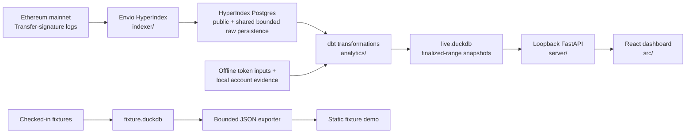

# EVM Wallet Search

A dashboard for exploring a wallet’s token activity on Ethereum, with each result connected to the
underlying transaction and blockchain data.

Give the local product an Ethereum address or supported ENS name and it processes the wallet's
missing finalized `Transfer(address,address,uint256)` ranges with Envio HyperIndex, builds
reproducible DuckDB analytics with dbt, and serves them through a loopback FastAPI API to a React
dashboard.

The project is Ethereum mainnet only (`chain_id = 1`). It treats
`Transfer(address,address,uint256)` as emitted contract evidence—not as proof of token standard,
intent, ownership, transaction initiation, legitimacy, or historical account type. ERC-721 uses
the same signature, and the wildcard indexer does not yet disambiguate it from ERC-20-like events.

## Choose the product path

| Path | What it is | Data boundary |
| --- | --- | --- |
| **Packaged local live product** | The primary application, run with Docker Compose on one loopback origin. It accepts a normalized address or conservatively validated ASCII ENS name and retains every successfully published wallet. | Exact calculations over complete local rows inside each wallet's recorded contiguous range through an Ethereum `finalized` block; rankings and event pages disclose their limits. It is not a publicly hosted scanner. |
| **Fixture-backed portfolio demo** | A static React build for GitHub Pages or another static host. It demonstrates the interface without a database, RPC credentials, or scan controls. | Small, bounded JSON generated from checked-in fixture rows. It does not establish live HyperIndex coverage or complete wallet history. |

These paths are selected at build time and cannot be mixed at runtime. The fixture `vitalik.eth`
label is pinned demo configuration only; it is never a live API fallback or evidence of live ENS
resolution.

## Dashboard preview

A current screenshot is intentionally not checked in. The
[dashboard image insertion point and verification checklist](docs/images/README.md) defines the
planned slot for the user-owned overview capture. Until that verified image is added, the
repository does not present an outdated screenshot as current product behavior.

## Run the local live product

Requirements: [Bun](https://bun.sh/) and Docker Desktop. Copy the environment template and add the
Envio HyperSync token used for live indexing. A user-supplied Ethereum mainnet RPC is optional for
ordinary scans; without one, the stack uses the documented public read-only fallback for ENS and
finalized-block checks.

```sh
cp .env.example .env
# Edit .env and set ENVIO_API_TOKEN.
bun run app:up -- 0xYOUR_ETHEREUM_ADDRESS
```

An ENS name is also accepted. The `app:up` command builds the images, starts persistent Postgres
and analytics volumes, scans only the wallet's missing range through a recorded finalized block,
waits for validated atomic DuckDB publication, and prints the loopback dashboard URL. A first scan
begins at block 0 and can take time for a highly active wallet. No live target is hardcoded, and the
fixture Vitalik target is never used as a fallback.

While a scan runs, the command and browser report elapsed time and the same honest named stages;
neither invents a percentage from the worker's coarse checkpoints.

```sh
bun run app:status
bun run app:logs
bun run app:down     # preserves Postgres and analytics volumes
```

Counterparty bytecode evidence remains an explicit, potentially RPC-intensive operation. With a
non-empty `ETHEREUM_RPC_URL` configured, `bun run app:enrich` checkpoints only missing shared
address evidence and atomically republishes every completed wallet projection.

The fixture build is separate from this live stack. Native component development and recovery
commands are in the [operations guide](docs/operations.md#native-component-development).

## What the dashboard shows

- exact selection totals alongside bounded rankings and cursor-paginated events;
- yearly and monthly captured-event timelines with explicit inbound, outbound, and self directions;
- token and counterparty rankings by captured event count, never cross-token quantity or value;
- provenance that separates finalized scan coverage from observed event extrema;
- `All`, `Recognized`, and `Other` token views, where recognition means exact-address registry
  membership or a manual local override—not safety;
- pinned-block `EOA`/`Contract` evidence, where `EOA` means only that no bytecode was observed at
  that block; and
- selection among completed local wallets without rescanning, plus separate address/ENS scan
  submission with stage-based progress, last-good dashboard preservation, retry, and automatic
  switching after validated publication.

Fixture mode keeps scan and recognition-write controls disabled. Its persistent disclosure marks
the rows as synthetic examples rather than live `vitalik.eth` history or HyperIndex completeness
evidence, shows exported-versus-complete event counts and sampling state, and labels the primary
total `Captured events`. Its fixture badge, bounded payload, and unrecorded scan coverage are part
of the contract, not caveats to hide.

## Scope and limitations

The MVP preserves emitted Transfer participants, exact raw values, wallet-relative direction,
selected top-level transaction sender/target evidence, exact-address token recognition, and
pinned-block bytecode observations for counterparties.

Local scan submission supports one explicit Ethereum address or resolvable ENS name per job. The
project does not operate a publicly hosted arbitrary-wallet scanner, and it does not include native
ETH transfers, traces, internal calls, approvals, NFT-specific interpretation, or USD prices.

Raw quantities remain exact strings and are never summed across token contracts. A self-transfer
remains one event but is neither inbound nor outbound. Recognition, metadata, ENS resolution, and
account type remain sourced, time-varying enrichment rather than canonical identity facts.

## Architecture



Each live build transforms one selected wallet interval, while `live.duckdb` retains completed
projections and finalized run history for every successfully published wallet. Shared token and
counterparty enrichment stay keyed by canonical address rather than being repeated per wallet.
The browser receives neither database/RPC credentials nor direct Postgres or DuckDB access.

See [ARCHITECTURE.md](ARCHITECTURE.md) for the dependency direction, trust boundaries, atomic
publication contract, and known gaps.

## Repository map

| Path | Ownership |
| --- | --- |
| [`indexer/`](indexer/README.md) | Envio capture scope, topic filters, entity schema, and handlers |
| [`analytics/`](analytics/README.md) | dbt staging, semantic evidence, marts, seeds, and isolated DuckDB artifacts |
| [`server/`](server/README.md) | Loopback API validation, exact bounded queries, and local recognition overrides |
| [`src/`](src/README.md) | React presentation and separate live/static data adapters |
| [`scripts/`](scripts/README.md) | Explicit orchestration, enrichment, export, and review entry points |
| [`tests/`](tests/README.md) | API, UI, export, enrichment, snapshot, and indexer contract tests |
| [`docs/`](docs/README.md) | Detailed architecture, data-model, operations, and image guidance |
| [`public/data/`](public/data/) | Ignored generated fixture JSON; never hand-edit |

## Documentation and verification

| Read this | For |
| --- | --- |
| [ARCHITECTURE.md](ARCHITECTURE.md) | System map, dependency direction, invariants, and current gaps |
| [docs/architecture.md](docs/architecture.md) | Detailed product behavior, semantics, filtering, and export policy |
| [docs/data-model.md](docs/data-model.md) | Grains, keys, fields, classifications, API/export contracts, and tests |
| [docs/operations.md](docs/operations.md) | Setup, credentials, commands, enrichment, recovery, and delivery |
| [AGENTS.md](AGENTS.md) | Maintainer workflow, validation, and documentation change routing |
| [dbt source contracts](analytics/models/) | Model descriptions, tests, provenance, consumers, and exposures |

Run `bun run static:check` for mandatory static analysis and `bun run test` for the deterministic
cross-layer suite. Fixture validation proves the fixture/demo contract; it does not prove live
HyperIndex behavior.
